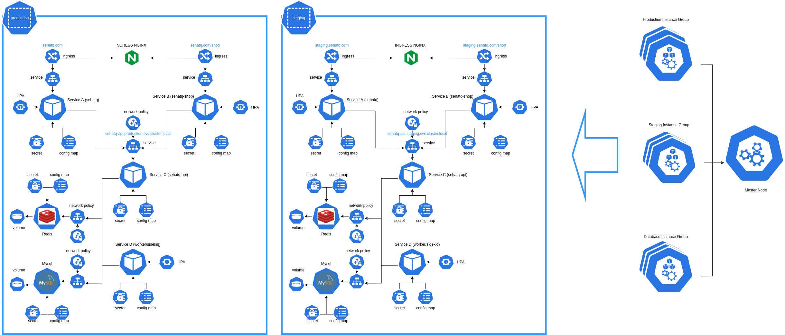

# Sehatq Kubernetes Assignment Workloads Diagram


# Cluster Setup
## Requirements
Make sure you have install kOps and kubectl.
* [kops](https://kops.sigs.k8s.io/install/)
* [kubectl](https://kubernetes.io/docs/tasks/tools/install-kubectl/)

## Setup Environment (AWS)
### Setup IAM User
kops will require this permissions
```
AmazonEC2FullAccess
AmazonRoute53FullAccess
AmazonS3FullAccess
IAMFullAccess
AmazonVPCFullAccess
```
### Configure DNS
example: `k8s.sehatq.com`. Dont forget to test your DNS, you should bea able to dig with this command.
```
dig ns k8s.sehatq.com
```
### Cluster State Storage
We use s3 to keep out cluster state. and strongly recommend versioning s3 bucket so we can recover to previous state.

## Create cluster
Create cluster with following commands:
```
kops create cluster \
  --zones=ap-southeast-1a \
  --state=s3://kops-state-sehatq \
  --master-size=c5.xlarge \
  --topology=private \
  --bastion="true" \
  k8s.sehatq.com
```
### Build the Cluster
Now we take the final step of actually building the cluster. This'll take a while. Once it finishes you'll have to wait longer while the booted instances finish downloading Kubernetes components and reach a "ready" state.
```
kops update cluster k8s.sehatq.com --yes
```
Note: Check cluster output file example in file ./kops/cluster.yaml

## Instance group
Create instace group for `database`, `production` & `staging` env specific nodes. Please check yaml file on folder `./kops/instance-group/*.yaml`
```
kops create ig database
kops create ig staging
kops create ig production
```

## Cluster Autoscaller
Cluster Autoscaler is a tool that automatically adjusts the size of the Kubernetes cluster when one of the following conditions is true:
* there are pods that failed to run in the cluster due to insufficient resources.
* there are nodes in the cluster that have been underutilized for an extended period of time and their pods can be placed on other existing nodes.
```
kubectl apply -f ./cluster-autoscaller.yaml
```

## Ingress NGINX
```
kubectl apply -f ./ingress-nginx.yaml
```

# Services Deployment
## Requirements
We use helm and secrets deploy services to k8s. Make helm3 and secrets are installed properly, and import public_key.asc to access encrypted value for deployments.
* [Helm 3](https://helm.sh/docs/intro/install/)
* [helm secrets plugins](https://github.com/jkroepke/helm-secrets)
* pgp key `./public_key.asc`

## Deployment
## Mysql Database (bitnami helm charts)
To install the chart with release name `sehatq-db` add repo:
```
$ helm repo add bitnami https://charts.bitnami.com/bitnami

# deploy for staging
$ helm upgrade --install --namespace staging sehatq-db bitnami/mysql -f ./helm-charts/mysql/values.yaml

# deploy for production
$ helm upgrade --install --namespace production sehatq-db bitnami/mysql -f ./helm-charts/mysql/values.yaml --set=architecture=replication
```

## Redis (bitnami helm charts)
To install redis.
```
$ helm repo add bitnami https://charts.bitnami.com/bitnami

# deploy for staging
$ helm upgrade --install --namespace staging sehatq-redis bitnami/redis

# deploy for production
$ helm upgrade --install --namespace production sehatq-redis bitnami/redis
```

## Service A (sehatq.com)
Run this following command:
```
# staging environment
helm secrets upgrade --install --namespace staging sehatq helm-charts/sehatq/ -f helm-charts/sehatq/helm_vars/secrets.staging.yaml

# production environments
helm secrets upgrade --install --namespace production sehatq helm-charts/sehatq/ -f helm-charts/sehatq/helm_vars/secrets.production.yaml --set=image.tag=0.1.0
```
Note: Change params image.tag=`0.1.0` base on application version you want to deploy.

## Service B (sehatq.com/shop)
Run this following command:
```
# staging environment
helm secrets upgrade --install --namespace staging sehatq-shop helm-charts/sehatq-shop/ -f helm-charts/sehatq-shop/helm_vars/secrets.staging.yaml

# production environments
helm secrets upgrade --install --namespace production sehatq-shop helm-charts/sehatq-shop/ -f helm-charts/sehatq-shop/helm_vars/secrets.production.yaml --set=image.tag=0.1.0
```
Note: Change params image.tag=`0.1.0` base on application version you want to deploy.

## Service C and D (API & Queue Worker)
Run this following command:
```
# staging environment
helm secrets upgrade --install --namespace staging sehatq-api helm-charts/sehatq-api/ -f helm-charts/sehatq-api/helm_vars/secrets.staging.yaml

# production environments
helm secrets upgrade --install --namespace production sehatq-api helm-charts/sehatq-api/ -f helm-charts/sehatq-api/helm_vars/secrets.production.yaml --set=image.tag=0.1.0
```
Note: Change params image.tag=`0.1.0` base on application version you want to deploy.
